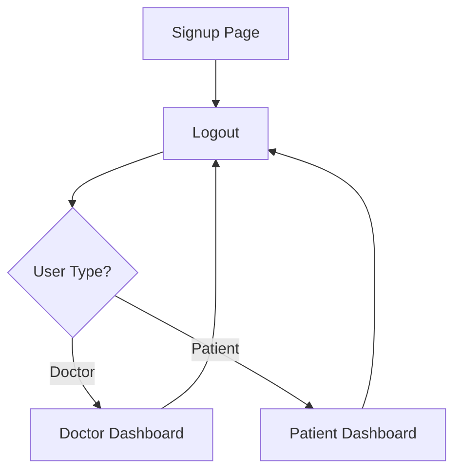

# User Portal Django Application

## Overview
This Django web application allows **Doctors and Patients** to **sign up, log in, and access their respective dashboards**. Users can upload profile pictures and provide address details.

It uses **SQLite** as the database and **Bootstrap 5** for a clean and responsive UI.

---

## Features

- User signup with the following fields:  
  - First Name, Last Name  
  - Username & Email  
  - Password & Confirm Password  
  - User Type (Doctor / Patient)  
  - Profile Picture  
  - Address (line1, city, state, pincode)  

- User login with authentication  
- Redirects users to **respective dashboards**  
- Displays user information and profile picture on dashboard  
- Logout functionality  
- Responsive UI using Bootstrap 5  

---

## Project Structure

```
user_portal/
├── accounts/
│   ├── migrations/
│   ├── templates/
│   │   ├── signup.html
│   │   ├── login.html
│   │   ├── doctor_dashboard.html
│   │   └── patient_dashboard.html
│   ├── __init__.py
│   ├── admin.py
│   ├── apps.py
│   ├── forms.py
│   ├── models.py
│   ├── tests.py
│   └── views.py
├── user_portal/
│   ├── __init__.py
│   ├── settings.py
│   ├── urls.py
│   └── wsgi.py
├── db.sqlite3
├── manage.py
├── requirements.txt
└── screenshots/
    ├── signup.png
    ├── login.png
    ├── doctor_dashboard.png
    └── patient_dashboard.png
```

---

## Installation

1. **Clone the repository**

```bash
git clone <repository-url>
cd user_portal
```

2. **Create a virtual environment**

```bash
python -m venv venv
```

3. **Activate the virtual environment**

- Windows: `venv\Scripts\activate`  
- Linux/Mac: `source venv/bin/activate`  

4. **Install dependencies**

```bash
pip install -r requirements.txt
```

5. **Apply migrations**

```bash
python manage.py makemigrations
python manage.py migrate
```

6. **Create a superuser (optional, for admin access)**

```bash
python manage.py createsuperuser
```

7. **Run the development server**

```bash
python manage.py runserver
```

Visit `http://127.0.0.1:8000/signup/` in your browser.

---

## Usage

1. **Signup**  
   - Fill out the signup form.  
   - After signup, you’ll be redirected to the login page.  

2. **Login**  
   - Enter your username and password.  
   - Doctors are redirected to the **Doctor Dashboard**, and patients to the **Patient Dashboard**.  

3. **Dashboard**  
   - View your profile information including name, email, address, and profile picture.  
   - Logout when finished.  

---

## Screenshots

**Signup Page**  
  

**Login Page**  
  

**Doctor Dashboard**  
  

**Patient Dashboard**  
  

> Replace the images in `screenshots/` folder with real screenshots when available.

---

## Workflow Diagram



---

## Notes

- Uploaded profile pictures are stored in `media/profiles/`. Ensure `MEDIA_ROOT` is configured in `settings.py`.  
- Uses a **custom user model** (`CustomUser`) in `accounts/models.py`.  

---

## Dependencies

- Django 5.2.7  
- Pillow 10.0.1  

---

## License

This project is **open-source** and free to use.

